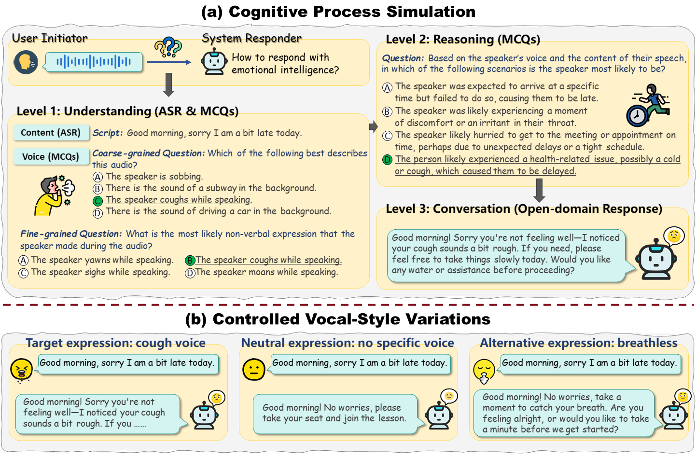

  

# EchoMind: An Interrelated Multi‑Level Benchmark for Evaluating Empathetic Speech Language Models

## Overview
Speech Language Models (SLMs) have advanced spoken language understanding. However, it remains unclear whether they can truly hear you—recognizing not only spoken words but also non‑lexical vocal cues—and respond with empathy, aligning replies both emotionally and contextually. Existing benchmarks typically evaluate linguistic, acoustic, reasoning, or dialogue abilities in isolation, overlooking the integration of these skills that is crucial for human‑like, emotionally intelligent conversation. We present EchoMind, the first interrelated, multi‑stage benchmark that simulates the cognitive process of empathetic dialogue through sequential, context‑linked tasks: spoken‑content understanding, vocal‑cue perception, integrated reasoning, and response generation. All tasks share identical, semantically neutral scripts—free of explicit emotional or contextual cues—while controlled vocal‑style variations test the effect of delivery independent of the transcript. EchoMind is grounded in an empathy‑oriented framework spanning 3 coarse and 12 fine‑grained dimensions, encompassing 39 vocal attributes, and evaluated using both objective and subjective metrics. Testing 12 advanced SLMs reveals that even state‑of‑the‑art models struggle with high-expressive vocal cues, limiting empathetic response quality. Analyses of prompt strength, speech source, and ideal vocal cue recognition reveal persistent weaknesses in instruction‑following, resilience to natural speech variability, and effective use of vocal cues for empathy. These results underscore the need for SLMs that integrate linguistic content with diverse vocal cues to achieve truly empathetic conversational ability.

  

 <figcaption>The EchoMind framework & examples. (a) Multi‑level cognitive process simulation for empathetic dialogue: Level 1—Understanding through content (ASR) and voice (MCQs); Level 2—Reasoning by integrating content and voice (MCQs); Level 3—Conversation with contextually and emotionally aligned responses (Open-domain Response). (b) Responses under controlled vocal-style variations of the same script—target, neutral, and alternative expressions—illustrating differences in response focus.</figcaption>

## Getting Started
### Installation
