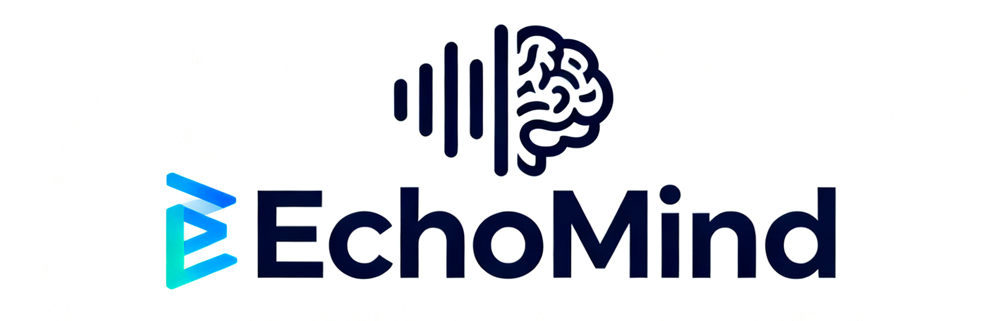

  

# EchoMind: An Interrelated Multi‑Level Benchmark for Evaluating Empathetic Speech Language Models
[**🌐 Homepage**](https://sakshi113.github.io/mmau_homepage/) | [**🏆 Leaderboard**](https://sakshi113.github.io/mmau_homepage/#leaderboard-v15-parsed) | [**📖 MMAU arXiv**](https://arxiv.org/pdf/2410.19168) | [**🔊 test-mini audios**](https://drive.google.com/file/d/1fERNIyTa0HWry6iIG1X-1ACPlUlhlRWA/view?usp=sharing) | [**🔊 test audios**](https://drive.google.com/file/d/1XqkRupC723zAeyDn4dYniqNv4uO-8rEg/view?usp=sharing)
  