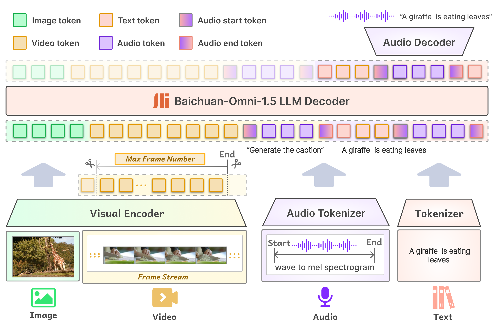
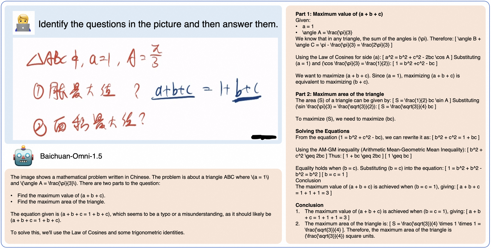

<div align="center">

</img>

## **Open-source Omni-modal Foundation Model Supporting Text, Image, Video, and Audio Inputs as Well as Text and Audio Outputs**

<strong>English | 
[中文](./README_zh.md)</strong>

<p align="center">
Baichuan-Omni-1.5 <a href="https://huggingface.co/baichuan-inc/Baichuan-Omni-1d5">🤗</a> | Baichuan-Omni-1.5-Base <a href="https://huggingface.co/baichuan-inc/Baichuan-Omni-1d5-Base">🤗</a>  | Technical Report <a href="https://arxiv.org/abs/2501.15368">📖</a> 
</p>
<p align="center">
OpenMM-Medical <a href="https://huggingface.co/datasets/baichuan-inc/OpenMM_Medical">🤗</a>  | OpenAudioBench <a href="https://huggingface.co/datasets/baichuan-inc/openAudioBench">🤗</a> 
</p>
</div>

**Baichuan-Omni-1.5** is the latest end-to-end trained omni-modal large model that supports comprehensive input modalities (text, image, video, audio) and dual output modalities (text and audio). Built upon the Qwen2.5-7B language model, it can process inputs from various modalities and generate high-quality text and speech outputs in a controllable manner.

- **Baichuan-Omni-1.5-Base**: To promote the development of omni-modal models, we have open-sourced a foundational model trained on high-quality, extensive datasets. This model has not undergone supervised fine-tuning (SFT) for instructions, offering great flexibility and serving as the **best-performing foundational omni-modal model** currently available.

- **Baichuan-Omni-1.5**: Leveraging the robust Baichuan-Omni-1.5-Base, this model undergoes end-to-end training with high-quality omni-modal aligned data. Baichuan-Omni-1.5 achieves text, image, video, and audio understanding capabilities comparable to **GPT-4o-mini**.

## 📖 Table of Contents

- [🏁 Baichuan-Omni-1.5](#baichuan-omni-1.5)
- [⭐ Model Architecture](#model-architecture)
- [🧠 Multi-stage Omni-modal Training Framework](#multi-stage-omni-modal-training-framework)
- [📊 Performance Evaluation](#performance-evaluation)
- [🍰 Example Use Cases](#example-use-cases)
- [🚀 Local WebUI Demo](#local-webui-demo)
  - [Image Demo](#image-demo)
  - [Video Demo](#video-demo)
  - [Audio Demo](#audio-demo)
- [⚙️ Fine-tuning](#fine-tuning)
- [📈 Open-source Evaluation Datasets](#open-source-evaluation-datasets)
- [📣 Acknowledgments](#acknowledgments)
- [⚠️ Disclaimer](#disclaimer)
- [📜 License](#license)
- [✒️ Citation](#citation)

## Baichuan-Omni-1.5

Baichuan-Omni-1.5 represents the latest and most advanced model in the Baichuan-omni series, trained and inferred through an end-to-end approach. Compared to the open-sourced counterparts, Baichuan-Omni-1.5 demonstrates significant improvements in the understanding of text, image, audio and video inputs. Notably, the model showcases impressive capabilities in controllable real-time voice interactions and collaborative real-time understanding across various modalities. In addition to its general capabilities, Baichuan-Omni-1.5 stands out as the most outstanding MLLM in the medical domain. This opens up exciting new possibilities for AGI to contribute to the well-being of human society. Based on the evaluation results, we summarize the key advantages and contributions of Baichuan-Omni-1.5:

- **Omni-modal Interaction**: Baichuan-Omni-1.5 is designed to process text, image, audio, and video inputs, delivering high-quality text and speech outputs. It is capable of achieving **seamless, high-quality cross-modal interactions** without compromising the capabilities of any modality.

- **Excellent Vision-Language Capability**: Baichuan-Omni-1.5 scores an average of 73.3 across ten image-understanding benchmarks, which surpasses **GPT-4o-mini** by an average of 6 points.

- **Unified and Outstanding Speech Capabilities**: We design an 8-layer RVQ audio tokenizer (**Baichuan-Audio-Tokenizer**) achieves an optimal balance between capturing semantic and acoustic information with 12.5 Hz frame rate, which supports **high-quality controllable bilingual (Chinese and English) real-time conversations**. At the same time, we have also open-sourced the audio understanding and generation benchmark (OpenAudio-Bench) to evaluate the end-to-end capabilities of audio. 

- **Leading Medical Image Understanding**: We collect a comprehensive medical understanding benchmark: OpenMM-Medical, which is an integration of existing datasets. **Our model achieves state-of-the-art perfor-mance on GMAI-MMBench and OpenMM-Medical**. Specifically, on OpenMM-Medical, Baichuan-Omni-1.5 scores 83.8% using a 7B LLM, surpassing Qwen2-VL-72B’s score of 80.7%.

### Model Architecture

<div align="center">

</div>

<br>

### Multi-stage Omni-modal Training Framework

<div align="center">

</div>

<br>

### Performance Evaluation

<div align="center">

</div>

<br>

<details>

<summary>Click here to view the detailed results of pure text understanding ability.</summary>

#### Pure text understanding ability
<div align="center">
    <table style="margin: 0 auto; text-align: center;">
    <thead>
        <tr>
            <th class="tg-c3ow" colspan="7">Comprehensive Tasks</th>
        </tr>
    </thead>
    <tbody>
    <tr>
        <td>Model</td>
        <td>Size</td>
        <td>MMLU <br> (Acc.)</td>
        <td>CMMLU <br> (Acc.)</td>
        <td>AGIEval <br> (Acc.)</td>
        <td>C-Eval <br> (Acc.)</td>
        <td>GAOKAO <br> (Acc.)</td>
    </tr>
    <tr>
        <td colspan="7">Proprietary Models</td>
    </tr>
    <tr>
        <td>GPT 4o</td>
        <td>-</td>
        <td><b>88.0♢<br></td>
        <td><b>78.3♢<br></td>
        <td><b>62.3♢<br></td>
        <td><b>86.0♢<br></td>
        <td>-</td>
    </tr>
    <tr>
        <td>GPT 4o mini</td>
        <td>-</td>
        <td>82.0</td>
        <td>67.6</td>
        <td>52.2</td>
        <td>63.6</td>
        <td>70.8</td>
    </tr>
    <tr>
         <td colspan="7">Open-source Models (Pure text)</td>
    </tr>
    <tr>
        <td>MAP-Neo</td>
        <td>7B</td>
        <td>58.2</td>
        <td>55.1</td>
        <td>33.9</td>
        <td>57.5</td>
        <td>-</td>
    </tr>
    <tr>
        <td>Qwen1.5-Chat</td>
        <td>7B</td>
        <td>61.5</td>
        <td>68.0</td>
        <td>39.3</td>
        <td>68.8</td>
        <td>-</td>
    </tr>
    <tr>
        <td>Llama3-Instruct</td>
        <td>8B</td>
        <td>67.1</td>
        <td>51.7</td>
        <td>38.4</td>
        <td>50.7</td>
        <td>-</td>
    </tr>
    <tr>
        <td>OLMo</td>
        <td>7B</td>
        <td>28.4</td>
        <td>25.6</td>
        <td>19.9</td>
        <td>27.3</td>
        <td>-</td>
    </tr>
    <tr>
         <td colspan="7">Open-source Models (Omni-modal)</td>
    </tr>
    <tr>
        <td>VITA</td>
        <td>8x7B</td>
        <td>71.0*</td>
        <td>46.6</td>
        <td>46.2*</td>
        <td>56.7*</td>
        <td>-</td>
    </tr>
    <tr>
        <td>VITA-1.5</td>
        <td>7B</td>
        <td>71.0</td>
        <td>75.1</td>
        <td>47.9</td>
        <td>65.6</td>
        <td>57.4</td>
    </tr>
    <tr>
        <td>Baichuan-Omni</td>
        <td>7B</td>
        <td>65.3</td>
        <td>72.2</td>
        <td>47.7</td>
        <td>68.9</td>
        <td>-</td>
    </tr>
    <tr>
        <td>MiniCPM-o 2.6</td>
        <td>7B</td>
        <td>65.3</td>
        <td>63.3</td>
        <td>50.9</td>
        <td>61.5</td>
        <td>56.3</td>
    </tr>
    <tr>
        <td><b>Baichuan-Omni-1.5<br></td>
        <td>7B</td>
        <td>72.2</td>
        <td>75.5</td>
        <td>54.4</td>
        <td>73.1</td>
        <td><b>73.5<br></td>
    </tr>
    </tbody>
    </table>
</div>

</details>

<details>

<summary>Click here to view detailed evaluation results of image understanding ability.</summary>

#### Image understanding ability

<div align="center">
  <table style="margin: 0 auto; text-align: center;">
    <thead>
      <tr>
         <th class="tg-c3ow" colspan="9">Multi-choice &amp; Yes-or-No Question</th>
      </tr>
    </thead>
    <tbody>
      <tr>
        <td>Model</td>
        <td>Size</td>
        <td>MMBench-EN <br>(Acc.)</td>
        <td>MMbench-CN <br>(Acc.)</td>
        <td>SEED-IMG <br>(Acc.)</td>
        <td>MMMU-val <br>(Acc.)</td>
        <td>HallusionBench <br>(Acc.)</td>
      </tr>
      <tr>
        <td colspan="9">Proprietary Models</td>
      </tr>
      <tr>
        <td>GPT-4o</td>
        <td>-</td>
        <td>83.4♢</td>
        <td>82.1♢</td>
        <td>-</td>
        <td><b>69.1♢<br></td>
        <td><b>55.0♢<br></td>
      </tr>
      <tr>
        <td>GPT-4o-mini</td>
        <td>-</td>
        <td>77.7</td>
        <td>76.9</td>
        <td>72.3</td>
        <td>60.0♢</td>
        <td>46.1♢</td>
      </tr>
      <tr>
        <td colspan="9">Open Source Models (Vision-Language)</td>
      </tr>
      <tr>
        <td>Qwen2-VL-7B</td>
        <td>7B</td>
        <td>81.7</td>
        <td>81.9</td>
        <td><b>76.5<br></td>
        <td>52.7</td>
        <td>50.6∗</td>
      </tr>
      <tr>
        <td>MiniCPM-Llama3-V 2.5</td>
        <td>8B</td>
        <td>76.7</td>
        <td>73.3</td>
        <td>72.4</td>
        <td>45.8∗</td>
        <td>42.5</td>
      </tr>
      <tr>
        <td colspan="9">Open Source Models (Omni-modal)</td>
      </tr>
      <tr>
        <td>VITA</td>
        <td>8x7B</td>
        <td>74.7</td>
        <td>71.4</td>
        <td>72.6</td>
        <td>45.3</td>
        <td>39.7∗</td>
      </tr>
      <tr>
        <td>VITA-1.5</td>
        <td>7B</td>
        <td>80.8</td>
        <td>80.2</td>
        <td>74.2</td>
        <td>53.1</td>
        <td>44.1</td>
      </tr>
      <tr>
        <td>Baichuan-Omni</td>
        <td>7B</td>
        <td>76.2</td>
        <td>74.9</td>
        <td>74.1</td>
        <td>47.3</td>
        <td>47.8</td>
      </tr>
      <tr>
        <td>MiniCPM-o 2.6</td>
        <td>7B</td>
        <td>83.6</td>
        <td>81.8</td>
        <td>75.4</td>
        <td>51.1</td>
        <td>50.1</td>
      </tr>
      <tr>
        <td><b>Baichuan-Omni-1.5<br></td>
        <td>7B</td>
        <td><b>85.6<br></td>
        <td><b>83.6<br></td>
        <td>75.7</td>
        <td>53.9</td>
        <td>49.7</td>
      </tr>
    </tbody>
  </table>
</div>


<br>

<div align="center">
  <table style="margin: 0 auto; text-align: center;">
    <thead>
      <tr>
        <th class="tg-c3ow" colspan="9">Visual Question Answering</th>
      </tr>
    </thead>
    <tbody>
      <tr>
        <td>Model</td>
        <td>Size</td>
        <td>RealWorldQA <br>(Acc.)</td>
        <td>MathVista-mini <br>(Acc.)</td>
        <td>TextVQA-val <br>(Acc.)</td>
        <td>ChartQA <br>(Acc.)</td>
        <td>OCRBench <br>(Acc.)</td>
      </tr>
      <tr>
        <td colspan="8">Proprietary Models</td>
      </tr>
      <tr>
        <td>GPT-4o</td>
        <td>-</td>
        <td><b>75.4♢<br></td>
        <td>63.8♢</td>
        <td>-</td>
        <td>85.7♢</td>
        <td>73.6♢</td>
      </tr>
      <tr>
        <td>GPT-4o-mini</td>
        <td>-</td>
        <td>66.3</td>
        <td>53.4</td>
        <td>66.8</td>
        <td>-</td>
        <td>77.4</td>
      </tr>
      <tr>
        <td colspan="8">Open Source Models (Vision-Language)</td>
      </tr>
      <tr>
        <td>Qwen2-VL-7B</td>
        <td>7B</td>
        <td>69.7</td>
        <td>58.2∗</td>
        <td><b>84.3∗<br></td>
        <td>83.0∗</td>
        <td>84.5∗</td>
      </tr>
      <tr>
        <td>MiniCPM-Llama3-V 2.5</td>
        <td>8B</td>
        <td>63.5</td>
        <td>54.3∗</td>
        <td>76.6</td>
        <td>72.0</td>
        <td>72.5</td>
      </tr>
      <tr>
        <td colspan="8">Open Source Models (Omni-modal)</td>
      </tr>
      <tr>
        <td>VITA</td>
        <td>8x7B</td>
        <td>59.0</td>
        <td>44.9∗</td>
        <td>71.8</td>
        <td>76.6</td>
        <td>68.5∗</td>
      </tr>
      <tr>
        <td>VITA-1.5</td>
        <td>7B</td>
        <td>66.8</td>
        <td><b>66.5<br></td>
        <td>74.9</td>
        <td>79.6</td>
        <td>73.3</td>
      </tr>
      <tr>
        <td>Baichuan-Omni</td>
        <td>7B</td>
        <td>62.6</td>
        <td>51.9</td>
        <td>74.3</td>
        <td>79.6</td>
        <td>70.0</td>
      </tr>
      <tr>
        <td>MiniCPM-o 2.6</td>
        <td>7B</td>
        <td>67.7</td>
        <td>64.6</td>
        <td>80.1</td>
        <td><b>87.6<br></td>
        <td><b>89.7∗<br></td>
      </tr>
       <tr>
        <td>Baichuan-Omni-1.5 </td>
        <td>7B</td>
        <td>68.8</td>
        <td>63.6</td>
        <td>83.2</td>
        <td>84.9</td>
        <td>84.0</td>
      </tr>
    </tbody>
  </table>
</div>


</details>

<details>

<summary>Click here to view detailed evaluation results of video understanding ability.</summary>

#### Video understanding ability
<div align="center">
  <table style="margin: 0 auto; text-align: center;">
    <thead>
      <tr>
        <th colspan="7">General VQA&nbsp;&nbsp;&nbsp;</th>
      </tr>
    </thead>
    <tbody>
      <tr>
        <td>Model</td>
        <td>Size</td>
        <td># Frames</td>
        <td>MVBench <br>(Acc.)</td>
        <td>Egoschema <br>(Acc.)</td>
        <td>VideoMME <br>(Acc.)</td>
        <td>Perception-Test <br>(Acc.)</td>
      </tr>
      <tr>
        <td colspan="7">Proprietary Models</td>
      </tr>
      <tr>
        <td>Gemini 1.5 Pro</td>
        <td>-</td>
        <td>-</td>
        <td><b>81.3♢<br></td>
        <td>63.2*</td>
        <td><b>75.0♢<br></td>
        <td>-</td>
      </tr>
      <tr>
        <td>GPT 4o mini</td>
        <td>-</td>
        <td>-</td>
        <td>55.2</td>
        <td>58.5</td>
        <td>63.6</td>
        <td>48.2</td>
      </tr>
      <tr>
        <td>GPT 4o</td>
        <td>-</td>
        <td>-</td>
        <td>-</td>
        <td><b>77.2*<br></td>
        <td>71.9♢</td>
        <td>-</td>
      </tr>
      <tr>
        <td>GPT 4V</td>
        <td>-</td>
        <td>-</td>
        <td>43.7♢</td>
        <td>55.6*</td>
        <td>59.9♢</td>
        <td>-</td>
      </tr>
      <tr>
        <td colspan="7">Open-source Models (Vision-language)</td>
      </tr>
      <tr>
        <td>Qwen2-VL-7B</td>
        <td>7B</td>
        <td>2 fps (max 768)</td>
        <td>67.0* | 64.4</td>
        <td>66.7* | 66.6</td>
        <td>63.3* | 59.0</td>
        <td>62.3* | 60.3</td>
      </tr>
      <tr>
        <td>AnyGPT</td>
        <td>8B</td>
        <td>48</td>
        <td>33.2</td>
        <td>32.1</td>
        <td>29.8</td>
        <td>29.1</td>
      </tr>
      <tr>
        <td>VideoLLaMA 2</td>
        <td>7B</td>
        <td>16</td>
        <td>54.6*</td>
        <td>51.7*</td>
        <td>46.6*</td>
        <td>51.4*</td>
      </tr>
      <tr>
        <td>VideoChat2</td>
        <td>7B</td>
        <td>16</td>
        <td>51.1*</td>
        <td>42.1♢</td>
        <td>33.7♢</td>
        <td>47.3♢</td>
      </tr>
      <tr>
        <td>LLaVA-NeXT-Video</td>
        <td>7B</td>
        <td>32</td>
        <td>46.5♢</td>
        <td>43.9♢</td>
        <td>33.7♢</td>
        <td>48.8♢</td>
      </tr>
      <tr>
        <td>Video-LLaVA</td>
        <td>7B</td>
        <td>8</td>
        <td>41.0♢</td>
        <td>38.4♢</td>
        <td>39.9♢</td>
        <td>44.3♢</td>
      </tr>
      <tr>
        <td colspan="7">Open-source Models (Omni-modal)</td>
      </tr>
      <tr>
        <td>VITA</td>
        <td>8x7B</td>
        <td>1 fps (max 32)</td>
        <td>53.4</td>
        <td>53.9</td>
        <td>56.1</td>
        <td>56.2</td>
      </tr>
      <tr>
        <td>VITA-1.5</td>
        <td>7B</td>
        <td>1 fps (max 32)</td>
        <td>55.5</td>
        <td>54.7</td>
        <td>57.3</td>
        <td>57.6</td>
      </tr>
      <tr>
        <td>Baichuan-Omni</td>
        <td>7B</td>
        <td>1 fps (max 32)</td>
        <td>60.9</td>
        <td>58.8</td>
        <td>58.2</td>
        <td>56.8</td>
      </tr>
      <tr>
        <td>MiniCPM-o 2.6</td>
        <td>7B</td>
        <td>1 fps (max 64)</td>
        <td>58.6</td>
        <td>50.7</td>
        <td>63.4</td>
        <td>66.6</td>
      </tr>
      <tr>
        <td>Baichuan-Omini-1.5</td>
        <td>7B</td>
        <td>1 fps (max 32)</td>
        <td> 63.7 </td>
        <td> 62.4 </td>
        <td> 60.1 </td>
        <td> <b>68.9 <br> </td>
      </tr>
    </tbody>
  </table>
</div>


<br>

<div align="center">
  <table style="margin: 0 auto; text-align: center;">
    <thead>
    <tr>
      <th colspan="7">Open-ended VQA</th>
    </tr>
  </thead>
  <tbody>
    <tr>
      <td rowspan="2">Model</td>
      <td rowspan="2">Size</td>
      <td rowspan="2"># Frames</td>
      <td colspan="2">ActivityNet-QA</td>
      <td colspan="2">MSVD-QA</td>
    </tr>
    <tr>
      <td>(Acc.)</td>
      <td>(Score)</td>
      <td>(Acc.)</td>
      <td>(Score)</td>
    </tr>
    <tr>
      <td colspan="7">Proprietary Models</td>
    </tr>
    <tr>
      <td>Gemini 1.5 Pro</td>
      <td>-</td>
      <td>-</td>
      <td>56.7*</td>
      <td>-</td>
      <td>-</td>
      <td>-</td>
    </tr>
    <tr>
      <td>GPT 4o mini</td>
      <td>-</td>
      <td>1 fps (max 32)</td>
      <td>62.1</td>
      <td>3.1</td>
      <td>67.5</td>
      <td>3.3</td>
    </tr>
    <tr>
      <td>GPT 4o</td>
      <td>-</td>
      <td>-</td>
      <td>61.9*</td>
      <td>-</td>
      <td>-</td>
      <td>-</td>
    </tr>
    <tr>
      <td>GPT 4V</td>
      <td>-</td>
      <td>-</td>
      <td>59.5*</td>
      <td>-</td>
      <td>-</td>
      <td>-</td>
    </tr>
    <tr>
      <td colspan="7">Open-source Models (Vision-language)</td>
    </tr>
    <tr>
      <td>Qwen2 VL</td>
      <td>7B</td>
      <td>2 fps (max 768)</td>
      <td>17.4</td>
      <td>1.9</td>
      <td>61.1</td>
      <td>3.5</td>
    </tr>
    <tr>
      <td>VideoLLaMA 2</td>
      <td>7B</td>
      <td>16</td>
      <td>50.2*</td>
      <td>3.3*</td>
      <td>70.9*</td>
      <td>3.8*</td>
    </tr>
    <tr>
      <td>VideoChat2</td>
      <td>7B</td>
      <td>16</td>
      <td>49.1*</td>
      <td>3.3*</td>
      <td>70.0*</td>
      <td>3.9*</td>
    </tr>
    <tr>
      <td>LLaVA-NeXT-Video</td>
      <td>7B</td>
      <td>32</td>
      <td>53.5*</td>
      <td>3.2*</td>
      <td>67.4</td>
      <td>3.4</td>
    </tr>
    <tr>
      <td>Video-LLaVA</td>
      <td>7B</td>
      <td>8</td>
      <td>45.3*</td>
      <td>3.3*</td>
      <td>70.7*</td>
      <td>3.9*</td>
    </tr>
    <tr>
      <td colspan="7">Open-source Models (Omni-modal)</td>
    </tr>
    <tr>
      <td>VITA</td>
      <td>8x7B</td>
      <td>1 fps (max 32)</td>
      <td>55.0</td>
      <td>3.5</td>
      <td>63.9</td>
      <td>3.7</td>
    </tr>
    <tr>
      <td>VITA-1.5</td>
      <td>7B</td>
      <td>1 fps (max 32)</td>
      <td>59.6</td>
      <td>3.0</td>
      <td>67.6</td>
      <td>3.3</td>
    </tr>
    <tr>
      <td>Baichuan-Omni</td>
      <td>7B</td>
      <td>1 fps (max 48)</td>
      <td>58.6</td>
      <td><b>3.7<br></td>
      <td>72.2</td>
      <td> <b>4.0<br> </td>
    </tr>
    <tr>
      <td>MiniCPM-o 2.6</td>
      <td>7B</td>
      <td>1 fps (max 64)</td>
      <td><b>63.0<br></td>
      <td>3.1</td>
      <td>73.7</td>
      <td>3.6</td>
    </tr>
    <tr>
      <td>Baichuan-Omni-1.5</td>
      <td>7B</td>
      <td>1 fps (max 48)</td>
      <td>  62.0</td>
      <td> 3.1</td>
      <td> <b> 74.2 <br></td>
      <td> 3.6</td>
    </tr>
  </tbody>
</table>
</div>

</details>

<details>

<summary>Click here to view detailed evaluation results of audio understanding and generation ability.</summary>

#### Audio understanding and generation ability
<div align="center">
  <table style="margin: 0 auto; text-align: center;">
  <thead>
    <tr>
      <th colspan="12">Audio Comprehensive Capacity</th>
    </tr></thead>
  <tbody>
    <tr>
      <td rowspan="2">Model</td>
      <td rowspan="2">Size</td>
      <td colspan="2">Reasoning QA</td>
      <td colspan="2">Llama Questions</td>
      <td colspan="2">Web Questions</td>
      <td colspan="2">TriviaQA</td>
      <td colspan="2">AlpacaEval</td>
    </tr>
    <tr>
      <td>s→t</td>
      <td>s→s</td>
      <td>s→t</td>
      <td>s→s</td>
      <td>s→t</td>
      <td>s→s</td>
      <td>s→t</td>
      <td>s→s</td>
      <td>s→t</td>
      <td>s→s</td>
    </tr>
    <tr>
      <td colspan="12">Proprietary Models</td>
    </tr>
    <tr>
      <td>GPT-4o-Audio</td>
      <td>-</td>
      <td><b>55.6</td>
      <td>-</td>
      <td><b>88.4</td>
      <td>-</td>
      <td><b>8.10</td>
      <td>-</td>
      <td><b>9.06</td>
      <td>-</td>
      <td><b>8.01</td>
      <td>-</td>
    </tr>
    <tr>
      <td colspan="12">Open-source Models (Pure Audio)</td>
    </tr>
    <tr>
      <td>GLM-4-Voice</td>
      <td>9B</td>
      <td>-</td>
      <td>26.5</td>
      <td>-</td>
      <td>71.0</td>
      <td>-</td>
      <td>5.15</td>
      <td>-</td>
      <td>4.66</td>
      <td>-</td>
      <td>4.89</td>
    </tr>
    <tr>
      <td colspan="12">Open-source Models (Omni-modal)</td>
    </tr>
    <tr>
      <td>VITA-1.5</td>
      <td>7B</td>
      <td>41.0</td>
      <td>-</td>
      <td>74.2</td>
      <td>-</td>
      <td>5.73</td>
      <td>-</td>
      <td>4.68</td>
      <td>-</td>
      <td>6.82</td>
      <td>-</td>
    </tr>
    <tr>
      <td>MiniCPM-o 2.6</td>
      <td>7B</td>
      <td>38.6</td>
      <td>-</td>
      <td>77.8</td>
      <td>-</td>
      <td>6.86</td>
      <td>-</td>
      <td>6.19</td>
      <td>-</td>
      <td>5.18</td>
      <td>-</td>
    </tr>
    <tr>
      <td><b>Baichuan-Omni-1.5</td>
      <td>7B</td>
      <td>50.0</td>
      <td><b>40.9</td>
      <td>78.5</td>
      <td><b>75.3</td>
      <td>5.91</td>
      <td><b>5.52</td>
      <td>5.72</td>
      <td>5.31</td>
      <td>7.79</td>
      <td><b>6.94</td>
    </tr>
  </tbody>
  </table>
</div>
</details>

<details>

<summary>Click here to view the detailed evaluation results of omni-modal understanding ability.</summary>

#### Omni-modal understanding ability

<div align="center">
  <table style="margin: 0 auto; text-align: center;">
    <thead>
      <tr>
        <th colspan="7">Omni-Undesratnding </th>
      </tr>
    <thead>
    <tbody>
          <tr>
          <td>Model</td>
          <td>Size</td>
          <td>Image & <br> Audio (Acc.)</td>
          <td>Image Caption & <br> Audio (Acc.)</td>
          <td>Image & Audio <br> Transcript (Acc.)</td>
          <td>Image Caption & <br> Audio Transcript (Acc.)</td>
          </tr>
      </thead>
      <tr>
        <td colspan="6">Proprietary Models</td>
      </tr>
      <tr>
        <td>GPT4o-mini</td>
        <td>-</td>
        <td>-</td>
        <td>-</td>
        <td>37.0</td>
        <td>37.7</td>
      </tr>
      <tr>
        <td colspan="6">Open-source Models (Omni-modal)</td>
      </tr>
      <tr>
        <td>VITA</td>
        <td>8x7B</td>
        <td>33.1</td>
        <td>31.8</td>
        <td>42.0</td>
        <td>44.2</td>
      </tr>
      <tr>
        <td>VITA-1.5</td>
        <td>7B</td>
        <td>33.4</td>
        <td>29.6</td>
        <td>48.5</td>
        <td><b>47.2<br></td>
      </tr>
      <tr>
        <td>Baichuan-Omni</td>
        <td>7B</td>
        <td>32.2</td>
        <td>26.5</td>
        <td>42.6</td>
        <td>44.2</td>
      </tr>
      <tr>
        <td>MiniCPM-o 2.6</td>
        <td>7B</td>
        <td>40.5</td>
        <td>30.8</td>
        <td><b>53.2<br></td>
        <td>46.3</td>
      </tr>
      <tr>
        <td><b>Baichuan-Omni-1.5<br></td>
        <td>7B</td>
        <td><b>42.9<br></td>
        <td><b>37.7<br></td>
        <td>47.9</td>
        <td>46.9</td>
      </tr>
    </tbody>
  </table>
</div>

</details>

<details>

<summary>Click here to view detailed evaluation results of medical image understanding ability.</summary>

#### Medical image understanding ability

<div align="center">
  <table style="margin: 0 auto; text-align: center;">
    <thead>
        <tr>
          <th colspan="7">Medical Understanding&nbsp;&nbsp;&nbsp;</th>
        </tr>
      </thead>
      <tbody>
          <tr>
          <td>Model</td>
          <td>Size</td>
          <td>GMAI-MMB-VAL <br> (Acc.)</td>
          <td>OpenMM-Medical <br> (Acc.)</td>
          </tr>
      </thead>
      <tr>
        <td colspan="4">Proprietary Models</td>
      </tr>
      <tr>
        <td>GPT4o-mini</td>
        <td>-</td>
        <td>46.4</td>
        <td>74.3</td>
      </tr>
      <tr>
        <td colspan="4">Open-source Models (Vision-Language)</td>
      </tr>
      <tr>
        <td>Qwen2 VL</td>
        <td>7B</td>
        <td>46.3</td>
        <td>76.9</td>
      </tr>
      <tr>
        <td>Qwen2 VL</td>
        <td>72B</td>
        <td><b>50.7<br></td>
        <td>80.7</td>
      </tr>
      <tr>
        <td colspan="4">Open-source Models (Omni-modal)</td>
      </tr>
      <tr>
        <td>VITA-1.5</td>
        <td>7B</td>
        <td>36.7</td>
        <td>67.1</td>
      </tr>
      <tr>
        <td>MiniCPM-o 2.6</td>
        <td>7B</td>
        <td>41.5</td>
        <td>73.6</td>
      </tr>
      <tr>
        <td><b>Baichuan-Omni-1.5<br></td>
        <td>7B</td>
        <td>49.9</td>
        <td><b>83.8<br></td>
      </tr>
    </tbody>
  </table>
</div>

</details>

### Typical Examples
<br>

<div style="display: flex; flex-direction: column; align-items: center;">
  
  
  
</div>

### Local WebUI Demo

#### Preparation

##### Creating a Virtual Environment
```bash
conda create -n baichuan_omni python==3.12
conda activate baichuan_omni
pip install torch==2.4.0 torchvision==0.19.0 torchaudio==2.4.0 --index-url https://download.pytorch.org/whl/cu124
pip install -r baichuan_omni_requirements.txt
pip install accelerate flash_attn==2.6.3 speechbrain==1.0.0 deepspeed==0.14.4
apt install llvm ffmpeg
```
##### Download the model and modify the model path
Modify MODEL_PATH in web_demo/constants.py to the local model path

#### Image Demo

```bash
cd web_demo
python vision_s2s_gradio_demo_cosy_multiturn.py
```

#### Audio Demo

```bash
cd web_demo
python s2s_gradio_demo_cosy_multiturn.py
```

#### Video Demo

```bash
cd web_demo
python video_s2s_gradio_demo_cosy_singleturn.py
```

### Fine-tuning
Coming soon

### Open-source Evaluation Datasets

**OpenMM-Medical**

To comprehensively evaluate the model's multi-modal medical capabilities, we have collected OpenMM-Medical, which includes data from public available medical image datasets such as ACRIMA (retinal images), BioMediTech (microscope images), and CoronaHack (X-rays), totaling 88,996 images.

**OpenAudioBench**

To efficiently assess the model's "IQ" issues, we developed OpenAudioBench, comprising five end-to-end audio understanding sub-datasets: four public benchmarks (Llama Question, WEB QA, TriviaQA, AlpacaEval), and an internally created speech logical reasoning dataset by the Baichuan team, totaling 2,701 entries. This suite reflects the model's comprehensive "IQ" level.

### Acknowledgments

- **Visual Encoder Architecture**: [NaVit](https://arxiv.org/abs/2307.06304v1)
- **Automatic Speech Recognition (ASR) Model**: [Whisper](https://github.com/openai/whisper)
- **Large Language Model (LLM)**: [Qwen2.5 7B](https://arxiv.org/abs/2412.15115)
- **Visual Encoder Weight Initialization**: Based on Qwen2-VL-7B ([Link](https://arxiv.org/abs/2409.12191))
- **Some Code Contributions**: From CosyVoice and Matcha-TTS ([CosyVoice GitHub](https://github.com/FunAudioLLM/CosyVoice), [Matcha-TTS GitHub](https://github.com/shivammehta25/Matcha-TTS/))
- **HiFi-GAN Vocoder Used in CosyVoice 2.0**: ([CosyVoice 2.0](https://funaudiollm.github.io/cosyvoice2/))

### Disclaimer

We strongly urge all users not to employ the Baichuan-Omni-1.5/Baichuan-Omni-1.5-Base models for any activities that may endanger national or social security or engage in illegal activities. Additionally, we request that these models not be used in internet services without proper safety reviews and registrations. We hope all users adhere to these guidelines to ensure technological development proceeds within a regulated and legal framework.

We have made every effort to ensure the compliance of the data used during the training process. However, despite our extensive efforts, due to the complexity of models and data, unforeseen issues may still arise. Therefore, we will not be held responsible for any problems arising from the use of the Baichuan-Omni-1.5/Baichuan-Omni-1.5-Base open-source models, including but not limited to data security issues, public opinion risks, or risks associated with misleading, misuse, dissemination, or improper utilization of the models.

### License

Community use of the Baichuan-Omni-1.5/Baichuan-Omni-1.5-Base models must comply with the Apache 2.0 license and the "Baichuan-Omni-1.5/Baichuan-Omni-1.5-Base Community License Agreement." These models support commercial use. If you plan to use the Baichuan-Omni-1.5/Baichuan-Omni-1.5-Base models or their derivatives for commercial purposes, please confirm that your entity meets the following criteria:
- Your or your affiliated party's daily active user count (DAU) is below 1 million.
- You or your affiliated party are not software service providers or cloud service providers.
- There is no possibility of re-granting the commercial license to third parties without prior approval from Baichuan Inc.

Under these conditions, you need to submit the required application materials for the "Baichuan-Omni-1.5/Baichuan-Omni-1.5-Base Community License Agreement" via email at opensource.contact@baichuan-inc.com. Upon approval, Baichuan Inc. will grant you a non-exclusive, global, non-transferable, non-sublicensable, and revocable commercial license.

### Citation

If you find our model/code/paper helpful, please consider citing our papers 📝 and staring us ⭐️！

```bib
@article{li2025baichuan,
  title={Baichuan-Omni-1.5 Technical Report},
  author={Li, Yadong and Liu, Jun and Zhang, Tao and Chen, Song and Li, Tianpeng and Li, Zehuan and Liu, Lijun and Ming, Lingfeng and Dong, Guosheng and Pan, Da and others},
  journal={arXiv preprint arXiv:2501.15368},
  year={2025}
}
```