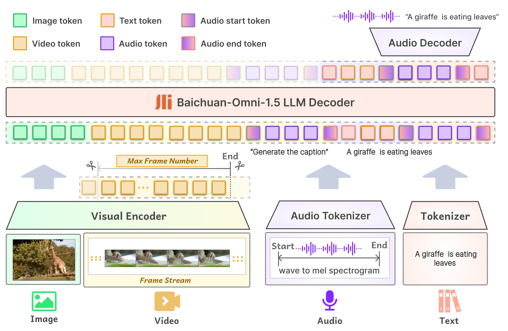
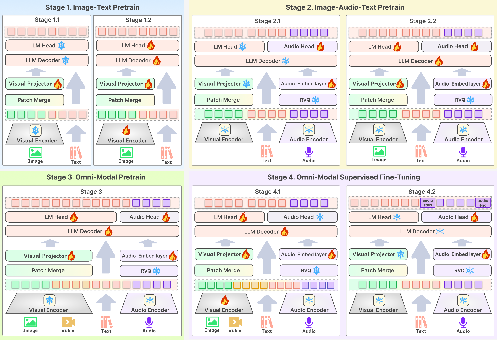
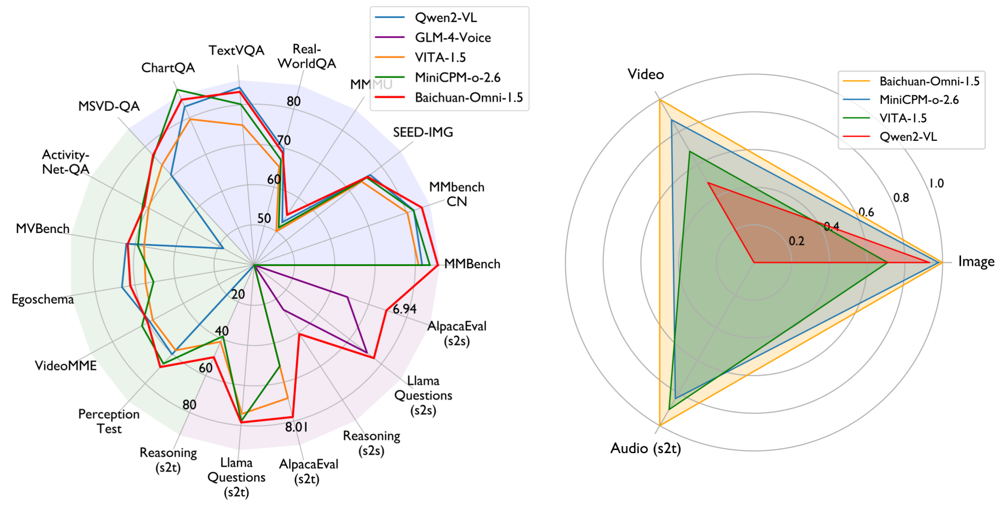
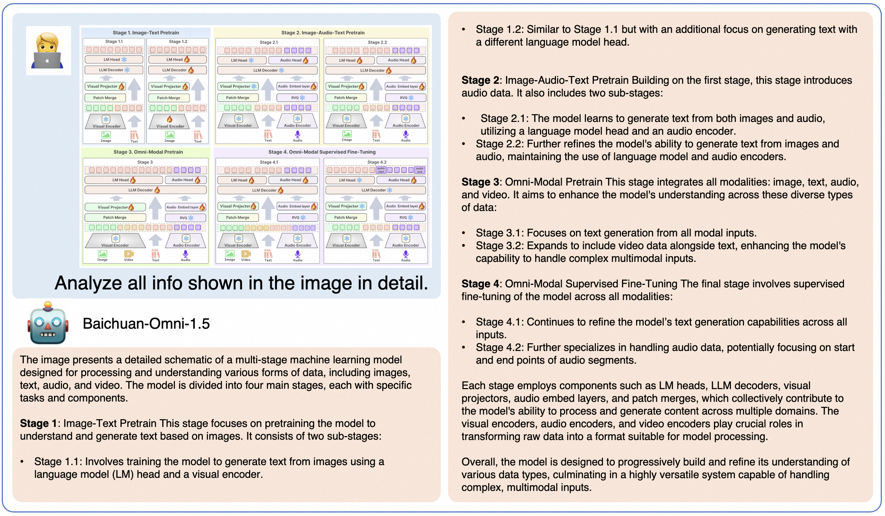
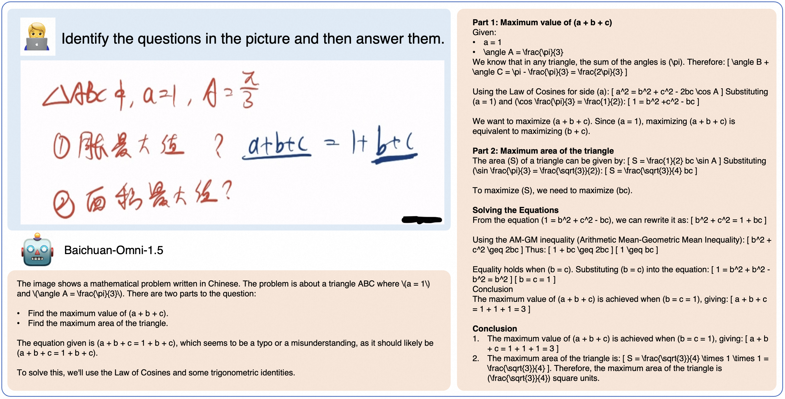
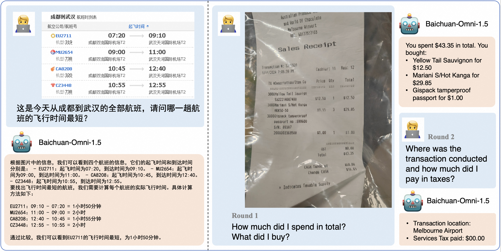

<div align="center">

</img> 

## **开源全模态基座，支持文本、图像、视频、音频输入以及文本、音频输出的全模态大模型**

  <strong>中文 |
  [English](./README.md)</strong>
  
  <p align="center">
  Baichuan-Omni-1.5 <a href="https://huggingface.co/baichuan-inc/Baichuan-Omni-1d5">🤗</a> | Baichuan-Omni-1.5-Base <a href="https://huggingface.co/baichuan-inc/Baichuan-Omni-1d5-Base">🤗</a>  | 技术报告 <a href="https://arxiv.org/abs/2501.15368">📖</a> 
</p>
  <p align="center">
    OpenMM-Medical <a href="https://huggingface.co/datasets/baichuan-inc/OpenMM_Medical">🤗</a> | OpenAudioBench <a href="https://huggingface.co/datasets/baichuan-inc/OpenAudioBench">🤗</a> 
</p>
</div>

**Baichuan-Omni-1.5** 是从 Baichuan-omni 升级的最新的、端到端训练的、支持全模态输入/双模态输出的多模态大模型。该模型使用Qwen2.5-7B作为大语言模型基座，可以端到端方式，接受图像、视频、文本、音频作为输入，并且以可控的方式生成高质量文本和语音。

- **Baichuan-Omni-1.5-Base**: 为促进全模态大模型发展，我们开源了使用高质量海量数据训练的全模态基座模型。该模型未经SFT指令微调，可塑性强，是**目前性能最好的全模态基座模型**。

- **Baichuan-Omni-1.5**: 基于性能强悍的Baichuan-Omni-1.5-base，使用高质量的全模态对齐数据，进行端到端的多模态指令数据训练。Baichuan-Omni-1.5的纯文本、图像、视频、音频理解能力达到了 GPT-4o-mini 级别。

## 📖 目录
- [**开源全模态基座，支持文本、图像、视频、音频输入以及文本、音频输出的全模态大模型**](#开源全模态基座支持文本图像视频音频输入以及文本音频输出的全模态大模型)
- [📖 目录](#-目录)
- [🏁 Baichuan-Omni-1.5](#baichuan-omni-15)
  - [⭐ 模型架构](#模型架构)
  - [🧠 多阶段全模态的训练框架](#多阶段全模态的训练框架)
  - [📊 性能评估](#性能评估)
    - [纯文本理解能力](#纯文本理解能力)
    - [图像理解能力](#图像理解能力)
    - [视频理解能力](#视频理解能力)
    - [语音理解与生成综合能力](#语音理解与生成综合能力)
    - [全模态理解能力](#全模态理解能力)
    - [医疗图像理解能力](#医疗图像理解能力)
  - [🍰 典型示例](#典型示例)
  - [🚀 本地 WebUI Demo](#本地-webui-demo)
    - [准备工作](#准备工作)
      - [创建虚拟环境](#创建虚拟环境)
      - [下载模型并修改模型路径](#下载模型并修改模型路径)
    - [图像Demo](#图像demo)
    - [音频Demo](#音频demo)
    - [视频Demo](#视频demo)
  - [⚙️ 微调](#微调)
  - [📈 开源评测集](#开源评测集)
  - [📣 致谢](#致谢)
  - [⚠️ 声明](#声明)
  - [📜 协议](#协议)
  - [✒️ 引用](#引用)

## Baichuan-Omni-1.5

Baichuan-Omni-1.5 是 Baichuan-omni 系列的最新、性能一流模型。该模型通过端到端方式训练和推理。与其他开源模型相比，Baichuan-Omni-1.5 在文本、图像、音频和视频输入的理解能力有显著提升，并支持了可控的实时语音对话和多模态实时交互的新功能。此外，Baichuan-Omni-1.5 也是目前最出色的开源医疗多模态模型。Baichuan-Omni-1.5 的主要特性包括：

- **多模态理解和交互能力：**
Baichuan-Omni-1.5 接受图像、视频、文本、音频作为输入，并生成高质量文本和语音输出，能够**在不损害任何模态能力的情况下实现无缝的高质量跨模态交互，并和用户进行实时语音对话**。在针对全模态理解的综合评测基准 OminiBench 中，Baichuan-Omni-1.5 取得开源社区一流水平，并**超过了 GPT-4o-mini**。

- **优秀的视觉能力：**
Baichuan-Omni-1.5 在 OpenCompass 常用的十个视觉评测集上平均得分 73.3，**在7B量级的大小下，在图像理解方面超越了 GPT-4o-mini，比GPT-4o-mini平均高出6分，并且和GPT-4o的结果相近**。此外，**视频理解表现也优于GPT-4V**。

- **出色的语音能力：**
Baichuan-Omni-1.5 通过一个 8 层 RVQ 音频Tokenizer（Baichuan-Audio-Tokenizer），在 12.5 Hz 帧率下实现了语义和声学信息捕获的最佳平衡，**支持高质量可控制声音的中英双语实时对话**。Baichuan-Omni-1.5 在语音理解任务**优于 GLM-4-Voice**，并在语音对话的语义和声学评估中展现了**开源模型中最高的语音生成性能**。同时，我们还开源了音频理解和生成基准（OpenAudio-Bench），以评估音频的端到端能力。

- **领先的医疗图像理解能力：**
我们从开源数据集中收集了一个比较全面的医学理解基准（OpenMM-Medical）用于评估模型的医学能力。Baichuan-Omni-1.5 **在 GMAI-MMBench 以及 OpenMM-Medical 上取得了最佳的表现**。在 OpenMM-Medical 上，Baichuan-Omni-1.5 仅使用 7B 的 LLM 取得了 83.8% 的高分，超过 Qwen2-VL-72B 的 80.7%。


### 模型架构

<div align="center">

</div>

<br>

### 多阶段全模态的训练框架

<div align="center">

</div>

<br>

### 性能评估

<div align="center">

</div>

<br>

<details>

<summary>点击查看纯文本理解能力详细评测结果。</summary>

#### 纯文本理解能力
<div align="center">
    <table style="margin: 0 auto; text-align: center;">
    <thead>
        <tr>
            <th class="tg-c3ow" colspan="7">Comprehensive Tasks</th>
        </tr>
    </thead>
    <tbody>
    <tr>
        <td>Model</td>
        <td>Size</td>
        <td>MMLU <br> (Acc.)</td>
        <td>CMMLU <br> (Acc.)</td>
        <td>AGIEval <br> (Acc.)</td>
        <td>C-Eval <br> (Acc.)</td>
        <td>GAOKAO <br> (Acc.)</td>
    </tr>
    <tr>
        <td colspan="7">Proprietary Models</td>
    </tr>
    <tr>
        <td>GPT 4o</td>
        <td>-</td>
        <td><b>88.0♢<br></td>
        <td><b>78.3♢<br></td>
        <td><b>62.3♢<br></td>
        <td><b>86.0♢<br></td>
        <td>-</td>
    </tr>
    <tr>
        <td>GPT 4o mini</td>
        <td>-</td>
        <td>82.0</td>
        <td>67.6</td>
        <td>52.2</td>
        <td>63.6</td>
        <td>70.8</td>
    </tr>
    <tr>
         <td colspan="7">Open-source Models (Pure text)</td>
    </tr>
    <tr>
        <td>MAP-Neo</td>
        <td>7B</td>
        <td>58.2</td>
        <td>55.1</td>
        <td>33.9</td>
        <td>57.5</td>
        <td>-</td>
    </tr>
    <tr>
        <td>Qwen1.5-Chat</td>
        <td>7B</td>
        <td>61.5</td>
        <td>68.0</td>
        <td>39.3</td>
        <td>68.8</td>
        <td>-</td>
    </tr>
    <tr>
        <td>Llama3-Instruct</td>
        <td>8B</td>
        <td>67.1</td>
        <td>51.7</td>
        <td>38.4</td>
        <td>50.7</td>
        <td>-</td>
    </tr>
    <tr>
        <td>OLMo</td>
        <td>7B</td>
        <td>28.4</td>
        <td>25.6</td>
        <td>19.9</td>
        <td>27.3</td>
        <td>-</td>
    </tr>
    <tr>
         <td colspan="7">Open-source Models (Omni-modal)</td>
    </tr>
    <tr>
        <td>VITA</td>
        <td>8x7B</td>
        <td>71.0*</td>
        <td>46.6</td>
        <td>46.2*</td>
        <td>56.7*</td>
        <td>-</td>
    </tr>
    <tr>
        <td>VITA-1.5</td>
        <td>7B</td>
        <td>71.0</td>
        <td>75.1</td>
        <td>47.9</td>
        <td>65.6</td>
        <td>57.4</td>
    </tr>
    <tr>
        <td>Baichuan-Omni</td>
        <td>7B</td>
        <td>65.3</td>
        <td>72.2</td>
        <td>47.7</td>
        <td>68.9</td>
        <td>-</td>
    </tr>
    <tr>
        <td>MiniCPM-o 2.6</td>
        <td>7B</td>
        <td>65.3</td>
        <td>63.3</td>
        <td>50.9</td>
        <td>61.5</td>
        <td>56.3</td>
    </tr>
    <tr>
        <td><b>Baichuan-Omni-1.5<br></td>
        <td>7B</td>
        <td>72.2</td>
        <td>75.5</td>
        <td>54.4</td>
        <td>73.1</td>
        <td><b>73.5<br></td>
    </tr>
    </tbody>
    </table>
</div>

</details>

<details>

<summary>点击查看图像理解能力详细评测结果。</summary>

#### 图像理解能力
<div align="center">
  <table style="margin: 0 auto; text-align: center;">
    <thead>
      <tr>
         <th class="tg-c3ow" colspan="9">Multi-choice &amp; Yes-or-No Question</th>
      </tr>
    </thead>
    <tbody>
      <tr>
        <td>Model</td>
        <td>Size</td>
        <td>MMBench-EN <br>(Acc.)</td>
        <td>MMbench-CN <br>(Acc.)</td>
        <td>SEED-IMG <br>(Acc.)</td>
        <td>MMMU-val <br>(Acc.)</td>
        <td>HallusionBench <br>(Acc.)</td>
      </tr>
      <tr>
        <td colspan="9">Proprietary Models</td>
      </tr>
      <tr>
        <td>GPT-4o</td>
        <td>-</td>
        <td>83.4♢</td>
        <td>82.1♢</td>
        <td>-</td>
        <td><b>69.1♢<br></td>
        <td><b>55.0♢<br></td>
      </tr>
      <tr>
        <td>GPT-4o-mini</td>
        <td>-</td>
        <td>77.7</td>
        <td>76.9</td>
        <td>72.3</td>
        <td>60.0♢</td>
        <td>46.1♢</td>
      </tr>
      <tr>
        <td colspan="9">Open Source Models (Vision-Language)</td>
      </tr>
      <tr>
        <td>Qwen2-VL-7B</td>
        <td>7B</td>
        <td>81.7</td>
        <td>81.9</td>
        <td><b>76.5<br></td>
        <td>52.7</td>
        <td>50.6∗</td>
      </tr>
      <tr>
        <td>MiniCPM-Llama3-V 2.5</td>
        <td>8B</td>
        <td>76.7</td>
        <td>73.3</td>
        <td>72.4</td>
        <td>45.8∗</td>
        <td>42.5</td>
      </tr>
      <tr>
        <td colspan="9">Open Source Models (Omni-modal)</td>
      </tr>
      <tr>
        <td>VITA</td>
        <td>8x7B</td>
        <td>74.7</td>
        <td>71.4</td>
        <td>72.6</td>
        <td>45.3</td>
        <td>39.7∗</td>
      </tr>
      <tr>
        <td>VITA-1.5</td>
        <td>7B</td>
        <td>80.8</td>
        <td>80.2</td>
        <td>74.2</td>
        <td>53.1</td>
        <td>44.1</td>
      </tr>
      <tr>
        <td>Baichuan-Omni</td>
        <td>7B</td>
        <td>76.2</td>
        <td>74.9</td>
        <td>74.1</td>
        <td>47.3</td>
        <td>47.8</td>
      </tr>
      <tr>
        <td>MiniCPM-o 2.6</td>
        <td>7B</td>
        <td>83.6</td>
        <td>81.8</td>
        <td>75.4</td>
        <td>51.1</td>
        <td>50.1</td>
      </tr>
      <tr>
        <td><b>Baichuan-Omni-1.5<br></td>
        <td>7B</td>
        <td><b>85.6<br></td>
        <td><b>83.6<br></td>
        <td>75.7</td>
        <td>53.9</td>
        <td>49.7</td>
      </tr>
    </tbody>
  </table>
</div>


<br>

<div align="center">
  <table style="margin: 0 auto; text-align: center;">
    <thead>
      <tr>
        <th class="tg-c3ow" colspan="9">Visual Question Answering</th>
      </tr>
    </thead>
    <tbody>
      <tr>
        <td>Model</td>
        <td>Size</td>
        <td>RealWorldQA <br>(Acc.)</td>
        <td>MathVista-mini <br>(Acc.)</td>
        <td>TextVQA-val <br>(Acc.)</td>
        <td>ChartQA <br>(Acc.)</td>
        <td>OCRBench <br>(Acc.)</td>
      </tr>
      <tr>
        <td colspan="8">Proprietary Models</td>
      </tr>
      <tr>
        <td>GPT-4o</td>
        <td>-</td>
        <td><b>75.4♢<br></td>
        <td>63.8♢</td>
        <td>-</td>
        <td>85.7♢</td>
        <td>73.6♢</td>
      </tr>
      <tr>
        <td>GPT-4o-mini</td>
        <td>-</td>
        <td>66.3</td>
        <td>53.4</td>
        <td>66.8</td>
        <td>-</td>
        <td>77.4</td>
      </tr>
      <tr>
        <td colspan="8">Open Source Models (Vision-Language)</td>
      </tr>
      <tr>
        <td>Qwen2-VL-7B</td>
        <td>7B</td>
        <td>69.7</td>
        <td>58.2∗</td>
        <td><b>84.3∗<br></td>
        <td>83.0∗</td>
        <td>84.5∗</td>
      </tr>
      <tr>
        <td>MiniCPM-Llama3-V 2.5</td>
        <td>8B</td>
        <td>63.5</td>
        <td>54.3∗</td>
        <td>76.6</td>
        <td>72.0</td>
        <td>72.5</td>
      </tr>
      <tr>
        <td colspan="8">Open Source Models (Omni-modal)</td>
      </tr>
      <tr>
        <td>VITA</td>
        <td>8x7B</td>
        <td>59.0</td>
        <td>44.9∗</td>
        <td>71.8</td>
        <td>76.6</td>
        <td>68.5∗</td>
      </tr>
      <tr>
        <td>VITA-1.5</td>
        <td>7B</td>
        <td>66.8</td>
        <td><b>66.5<br></td>
        <td>74.9</td>
        <td>79.6</td>
        <td>73.3</td>
      </tr>
      <tr>
        <td>Baichuan-Omni</td>
        <td>7B</td>
        <td>62.6</td>
        <td>51.9</td>
        <td>74.3</td>
        <td>79.6</td>
        <td>70.0</td>
      </tr>
      <tr>
        <td>MiniCPM-o 2.6</td>
        <td>7B</td>
        <td>67.7</td>
        <td>64.6</td>
        <td>80.1</td>
        <td><b>87.6<br></td>
        <td><b>89.7∗<br></td>
      </tr>
       <tr>
        <td>Baichuan-Omni-1.5 </td>
        <td>7B</td>
        <td>68.8</td>
        <td>63.6</td>
        <td>83.2</td>
        <td>84.9</td>
        <td>84.0</td>
      </tr>
    </tbody>
  </table>
</div>


</details>

<details>

<summary>点击查看视频理解能力详细评测结果。</summary>

#### 视频理解能力
<div align="center">
  <table style="margin: 0 auto; text-align: center;">
    <thead>
      <tr>
        <th colspan="7">General VQA&nbsp;&nbsp;&nbsp;</th>
      </tr>
    </thead>
    <tbody>
      <tr>
        <td>Model</td>
        <td>Size</td>
        <td># Frames</td>
        <td>MVBench <br>(Acc.)</td>
        <td>Egoschema <br>(Acc.)</td>
        <td>VideoMME <br>(Acc.)</td>
        <td>Perception-Test <br>(Acc.)</td>
      </tr>
      <tr>
        <td colspan="7">Proprietary Models</td>
      </tr>
      <tr>
        <td>Gemini 1.5 Pro</td>
        <td>-</td>
        <td>-</td>
        <td><b>81.3♢<br></td>
        <td>63.2*</td>
        <td><b>75.0♢<br></td>
        <td>-</td>
      </tr>
      <tr>
        <td>GPT 4o mini</td>
        <td>-</td>
        <td>-</td>
        <td>55.2</td>
        <td>58.5</td>
        <td>63.6</td>
        <td>48.2</td>
      </tr>
      <tr>
        <td>GPT 4o</td>
        <td>-</td>
        <td>-</td>
        <td>-</td>
        <td><b>77.2*<br></td>
        <td>71.9♢</td>
        <td>-</td>
      </tr>
      <tr>
        <td>GPT 4V</td>
        <td>-</td>
        <td>-</td>
        <td>43.7♢</td>
        <td>55.6*</td>
        <td>59.9♢</td>
        <td>-</td>
      </tr>
      <tr>
        <td colspan="7">Open-source Models (Vision-language)</td>
      </tr>
      <tr>
        <td>Qwen2-VL-7B</td>
        <td>7B</td>
        <td>2 fps (max 768)</td>
        <td>67.0* | 64.4</td>
        <td>66.7* | 66.6</td>
        <td>63.3* | 59.0</td>
        <td>62.3* | 60.3</td>
      </tr>
      <tr>
        <td>AnyGPT</td>
        <td>8B</td>
        <td>48</td>
        <td>33.2</td>
        <td>32.1</td>
        <td>29.8</td>
        <td>29.1</td>
      </tr>
      <tr>
        <td>VideoLLaMA 2</td>
        <td>7B</td>
        <td>16</td>
        <td>54.6*</td>
        <td>51.7*</td>
        <td>46.6*</td>
        <td>51.4*</td>
      </tr>
      <tr>
        <td>VideoChat2</td>
        <td>7B</td>
        <td>16</td>
        <td>51.1*</td>
        <td>42.1♢</td>
        <td>33.7♢</td>
        <td>47.3♢</td>
      </tr>
      <tr>
        <td>LLaVA-NeXT-Video</td>
        <td>7B</td>
        <td>32</td>
        <td>46.5♢</td>
        <td>43.9♢</td>
        <td>33.7♢</td>
        <td>48.8♢</td>
      </tr>
      <tr>
        <td>Video-LLaVA</td>
        <td>7B</td>
        <td>8</td>
        <td>41.0♢</td>
        <td>38.4♢</td>
        <td>39.9♢</td>
        <td>44.3♢</td>
      </tr>
      <tr>
        <td colspan="7">Open-source Models (Omni-modal)</td>
      </tr>
      <tr>
        <td>VITA</td>
        <td>8x7B</td>
        <td>1 fps (max 32)</td>
        <td>53.4</td>
        <td>53.9</td>
        <td>56.1</td>
        <td>56.2</td>
      </tr>
      <tr>
        <td>VITA-1.5</td>
        <td>7B</td>
        <td>1 fps (max 32)</td>
        <td>55.5</td>
        <td>54.7</td>
        <td>57.3</td>
        <td>57.6</td>
      </tr>
      <tr>
        <td>Baichuan-Omni</td>
        <td>7B</td>
        <td>1 fps (max 32)</td>
        <td>60.9</td>
        <td>58.8</td>
        <td>58.2</td>
        <td>56.8</td>
      </tr>
      <tr>
        <td>MiniCPM-o 2.6</td>
        <td>7B</td>
        <td>1 fps (max 64)</td>
        <td>58.6</td>
        <td>50.7</td>
        <td>63.4</td>
        <td>66.6</td>
      </tr>
      <tr>
        <td>Baichuan-Omini-1.5</td>
        <td>7B</td>
        <td>1 fps (max 32)</td>
        <td> 63.7 </td>
        <td> 62.4 </td>
        <td> 60.1 </td>
        <td> <b>68.9 <br> </td>
      </tr>
    </tbody>
  </table>
</div>


<br>

<div align="center">
  <table style="margin: 0 auto; text-align: center;">
    <thead>
    <tr>
      <th colspan="7">Open-ended VQA</th>
    </tr>
  </thead>
  <tbody>
    <tr>
      <td rowspan="2">Model</td>
      <td rowspan="2">Size</td>
      <td rowspan="2"># Frames</td>
      <td colspan="2">ActivityNet-QA</td>
      <td colspan="2">MSVD-QA</td>
    </tr>
    <tr>
      <td>(Acc.)</td>
      <td>(Score)</td>
      <td>(Acc.)</td>
      <td>(Score)</td>
    </tr>
    <tr>
      <td colspan="7">Proprietary Models</td>
    </tr>
    <tr>
      <td>Gemini 1.5 Pro</td>
      <td>-</td>
      <td>-</td>
      <td>56.7*</td>
      <td>-</td>
      <td>-</td>
      <td>-</td>
    </tr>
    <tr>
      <td>GPT 4o mini</td>
      <td>-</td>
      <td>1 fps (max 32)</td>
      <td>62.1</td>
      <td>3.1</td>
      <td>67.5</td>
      <td>3.3</td>
    </tr>
    <tr>
      <td>GPT 4o</td>
      <td>-</td>
      <td>-</td>
      <td>61.9*</td>
      <td>-</td>
      <td>-</td>
      <td>-</td>
    </tr>
    <tr>
      <td>GPT 4V</td>
      <td>-</td>
      <td>-</td>
      <td>59.5*</td>
      <td>-</td>
      <td>-</td>
      <td>-</td>
    </tr>
    <tr>
      <td colspan="7">Open-source Models (Vision-language)</td>
    </tr>
    <tr>
      <td>Qwen2 VL</td>
      <td>7B</td>
      <td>2 fps (max 768)</td>
      <td>17.4</td>
      <td>1.9</td>
      <td>61.1</td>
      <td>3.5</td>
    </tr>
    <tr>
      <td>VideoLLaMA 2</td>
      <td>7B</td>
      <td>16</td>
      <td>50.2*</td>
      <td>3.3*</td>
      <td>70.9*</td>
      <td>3.8*</td>
    </tr>
    <tr>
      <td>VideoChat2</td>
      <td>7B</td>
      <td>16</td>
      <td>49.1*</td>
      <td>3.3*</td>
      <td>70.0*</td>
      <td>3.9*</td>
    </tr>
    <tr>
      <td>LLaVA-NeXT-Video</td>
      <td>7B</td>
      <td>32</td>
      <td>53.5*</td>
      <td>3.2*</td>
      <td>67.4</td>
      <td>3.4</td>
    </tr>
    <tr>
      <td>Video-LLaVA</td>
      <td>7B</td>
      <td>8</td>
      <td>45.3*</td>
      <td>3.3*</td>
      <td>70.7*</td>
      <td>3.9*</td>
    </tr>
    <tr>
      <td colspan="7">Open-source Models (Omni-modal)</td>
    </tr>
    <tr>
      <td>VITA</td>
      <td>8x7B</td>
      <td>1 fps (max 32)</td>
      <td>55.0</td>
      <td>3.5</td>
      <td>63.9</td>
      <td>3.7</td>
    </tr>
    <tr>
      <td>VITA-1.5</td>
      <td>7B</td>
      <td>1 fps (max 32)</td>
      <td>59.6</td>
      <td>3.0</td>
      <td>67.6</td>
      <td>3.3</td>
    </tr>
    <tr>
      <td>Baichuan-Omni</td>
      <td>7B</td>
      <td>1 fps (max 48)</td>
      <td>58.6</td>
      <td><b>3.7<br></td>
      <td>72.2</td>
      <td> <b>4.0<br> </td>
    </tr>
    <tr>
      <td>MiniCPM-o 2.6</td>
      <td>7B</td>
      <td>1 fps (max 64)</td>
      <td><b>63.0<br></td>
      <td>3.1</td>
      <td>73.7</td>
      <td>3.6</td>
    </tr>
    <tr>
      <td>Baichuan-Omni-1.5</td>
      <td>7B</td>
      <td>1 fps (max 48)</td>
      <td>  62.0</td>
      <td> 3.1</td>
      <td> <b> 74.2 <br></td>
      <td> 3.6</td>
    </tr>
  </tbody>
</table>
</div>

</details>

<details>

<summary>点击查看语音理解与生成能力详细评测结果。</summary>

#### 语音理解与生成综合能力
<div align="center">
  <table style="margin: 0 auto; text-align: center;">
  <thead>
    <tr>
      <th colspan="12">Audio Comprehensive Capacity</th>
    </tr></thead>
  <tbody>
    <tr>
      <td rowspan="2">Model</td>
      <td rowspan="2">Size</td>
      <td colspan="2">Reasoning QA</td>
      <td colspan="2">Llama Questions</td>
      <td colspan="2">Web Questions</td>
      <td colspan="2">TriviaQA</td>
      <td colspan="2">AlpacaEval</td>
    </tr>
    <tr>
      <td>s→t</td>
      <td>s→s</td>
      <td>s→t</td>
      <td>s→s</td>
      <td>s→t</td>
      <td>s→s</td>
      <td>s→t</td>
      <td>s→s</td>
      <td>s→t</td>
      <td>s→s</td>
    </tr>
    <tr>
      <td colspan="12">Proprietary Models</td>
    </tr>
    <tr>
      <td>GPT-4o-Audio</td>
      <td>-</td>
      <td><b>55.6</td>
      <td>-</td>
      <td><b>88.4</td>
      <td>-</td>
      <td><b>8.10</td>
      <td>-</td>
      <td><b>9.06</td>
      <td>-</td>
      <td><b>8.01</td>
      <td>-</td>
    </tr>
    <tr>
      <td colspan="12">Open-source Models (Pure Audio)</td>
    </tr>
    <tr>
      <td>GLM-4-Voice</td>
      <td>9B</td>
      <td>-</td>
      <td>26.5</td>
      <td>-</td>
      <td>71.0</td>
      <td>-</td>
      <td>5.15</td>
      <td>-</td>
      <td>4.66</td>
      <td>-</td>
      <td>4.89</td>
    </tr>
    <tr>
      <td colspan="12">Open-source Models (Omni-modal)</td>
    </tr>
    <tr>
      <td>VITA-1.5</td>
      <td>7B</td>
      <td>41.0</td>
      <td>-</td>
      <td>74.2</td>
      <td>-</td>
      <td>5.73</td>
      <td>-</td>
      <td>4.68</td>
      <td>-</td>
      <td>6.82</td>
      <td>-</td>
    </tr>
    <tr>
      <td>MiniCPM-o 2.6</td>
      <td>7B</td>
      <td>38.6</td>
      <td>-</td>
      <td>77.8</td>
      <td>-</td>
      <td>6.86</td>
      <td>-</td>
      <td>6.19</td>
      <td>-</td>
      <td>5.18</td>
      <td>-</td>
    </tr>
    <tr>
      <td><b>Baichuan-Omni-1.5</td>
      <td>7B</td>
      <td>50.0</td>
      <td><b>40.9</td>
      <td>78.5</td>
      <td><b>75.3</td>
      <td>5.91</td>
      <td><b>5.52</td>
      <td>5.72</td>
      <td>5.31</td>
      <td>7.79</td>
      <td><b>6.94</td>
    </tr>
  </tbody>
  </table>
</div>


</details>

<details>

<summary>点击查看全模态理解能力详细评测结果。</summary>

#### 全模态理解能力

<div align="center">
  <table style="margin: 0 auto; text-align: center;">
    <thead>
      <tr>
        <th colspan="7">Omni-Undesratnding </th>
      </tr>
    <thead>
    <tbody>
          <tr>
          <td>Model</td>
          <td>Size</td>
          <td>Image & <br> Audio (Acc.)</td>
          <td>Image Caption & <br> Audio (Acc.)</td>
          <td>Image & Audio <br> Transcript (Acc.)</td>
          <td>Image Caption & <br> Audio Transcript (Acc.)</td>
          </tr>
      </thead>
      <tr>
        <td colspan="6">Proprietary Models</td>
      </tr>
      <tr>
        <td>GPT4o-mini</td>
        <td>-</td>
        <td>-</td>
        <td>-</td>
        <td>37.0</td>
        <td>37.7</td>
      </tr>
      <tr>
        <td colspan="6">Open-source Models (Omni-modal)</td>
      </tr>
      <tr>
        <td>VITA</td>
        <td>8x7B</td>
        <td>33.1</td>
        <td>31.8</td>
        <td>42.0</td>
        <td>44.2</td>
      </tr>
      <tr>
        <td>VITA-1.5</td>
        <td>7B</td>
        <td>33.4</td>
        <td>29.6</td>
        <td>48.5</td>
        <td><b>47.2<br></td>
      </tr>
      <tr>
        <td>Baichuan-Omni</td>
        <td>7B</td>
        <td>32.2</td>
        <td>26.5</td>
        <td>42.6</td>
        <td>44.2</td>
      </tr>
      <tr>
        <td>MiniCPM-o 2.6</td>
        <td>7B</td>
        <td>40.5</td>
        <td>30.8</td>
        <td><b>53.2<br></td>
        <td>46.3</td>
      </tr>
      <tr>
        <td><b>Baichuan-Omni-1.5<br></td>
        <td>7B</td>
        <td><b>42.9<br></td>
        <td><b>37.7<br></td>
        <td>47.9</td>
        <td>46.9</td>
      </tr>
    </tbody>
  </table>
</div>

</details>

<details>

<summary>点击查看医疗图像理解能力详细评测结果。</summary>

#### 医疗图像理解能力

<div align="center">
  <table style="margin: 0 auto; text-align: center;">
    <thead>
        <tr>
          <th colspan="7">Medical Understanding&nbsp;&nbsp;&nbsp;</th>
        </tr>
      </thead>
      <tbody>
          <tr>
          <td>Model</td>
          <td>Size</td>
          <td>GMAI-MMB-VAL <br> (Acc.)</td>
          <td>OpenMM-Medical <br> (Acc.)</td>
          </tr>
      </thead>
      <tr>
        <td colspan="4">Proprietary Models</td>
      </tr>
      <tr>
        <td>GPT4o-mini</td>
        <td>-</td>
        <td>46.4</td>
        <td>74.3</td>
      </tr>
      <tr>
        <td colspan="4">Open-source Models (Vision-Language)</td>
      </tr>
      <tr>
        <td>Qwen2 VL</td>
        <td>7B</td>
        <td>46.3</td>
        <td>76.9</td>
      </tr>
      <tr>
        <td>Qwen2 VL</td>
        <td>72B</td>
        <td><b>50.7<br></td>
        <td>80.7</td>
      </tr>
      <tr>
        <td colspan="4">Open-source Models (Omni-modal)</td>
      </tr>
      <tr>
        <td>VITA-1.5</td>
        <td>7B</td>
        <td>36.7</td>
        <td>67.1</td>
      </tr>
      <tr>
        <td>MiniCPM-o 2.6</td>
        <td>7B</td>
        <td>41.5</td>
        <td>73.6</td>
      </tr>
      <tr>
        <td><b>Baichuan-Omni-1.5<br></td>
        <td>7B</td>
        <td>49.9</td>
        <td><b>83.8<br></td>
      </tr>
    </tbody>
  </table>
</div>

</details>

### 典型示例
<br>

<div style="display: flex; flex-direction: column; align-items: center;">
  
  
  
</div>

### 本地 WebUI Demo

#### 准备工作

##### 创建虚拟环境
```bash
conda create -n baichuan_omni python==3.12
conda activate baichuan_omni
pip install torch==2.4.0 torchvision==0.19.0 torchaudio==2.4.0 --index-url https://download.pytorch.org/whl/cu124
pip install -r baichuan_omni_requirements.txt
pip install accelerate flash_attn==2.6.3 speechbrain==1.0.0 deepspeed==0.14.4
apt install llvm ffmpeg
```
##### 下载模型并修改模型路径
修改 web_demo/constants.py 中的 MODEL_PATH 为本地模型路径

#### 图像Demo

```bash
cd web_demo
python vision_s2s_gradio_demo_cosy_multiturn.py
```

#### 音频Demo

```bash
cd web_demo
python s2s_gradio_demo_cosy_multiturn.py
```

#### 视频Demo

```bash
cd web_demo
python video_s2s_gradio_demo_cosy_singleturn.py
```

### 微调
coming soon

### 开源评测集
**OpenMM-Medical**

为了更全面的评估模型医疗多模态能力，我们从公开医学图像数据集中收集了 OpenMM-Medical 评测集，包含 ACRIMA（眼底图像）、BioMediTech（显微镜图像）和 CoronaHack（X 射线）等，总共包含 88,996 张图像。

**OpenAudioBench**

为了更高效的评估模型的“智商”问题，我们构建了 OpenAudioBench，共包含5个音频端到端理解子评测集，分别是4个公开评测集（llama question、WEB QA、TriviaQA、AlpacaEval），以及百川团队自建的语音逻辑推理评测集，共2701条数据，能够综合反映模型“智商”水平。

### 致谢

- 视觉编码器架构：【NaVit】(https://arxiv.org/abs/2307.06304v1)
- 自动语音识别（ASR, Automatic Speech Recognition）模型：【Whisper】(https://github.com/openai/whisper)
- 大语言模型（LLM）：【Qwen2.5 7B】(https://arxiv.org/abs/2412.15115)
- 视觉编码器的权重初始化于Qwen2-VL-7B：（https://arxiv.org/abs/2409.12191）
- 部分代码来自：CosyVoice和Matcha-TTS：(https://github.com/FunAudioLLM/CosyVoice, https://github.com/shivammehta25/Matcha-TTS/)
- 使用CosyVoice 2.0中的HiFi-GAN vocoder：(https://funaudiollm.github.io/cosyvoice2/)

### 声明
我们强烈呼吁所有使用者，不要利用 Baichuan-Omni-1.5/Baichuan-Omni-1.5-Base 模型进行任何危害国家社会安全或违法的活动。另外，我们也要求使用者不要将 Baichuan-Omni-1.5/Baichuan-Omni-1.5-Base 模型用于未经适当安全审查和备案的互联网服务。我们希望所有的使用者都能遵守这个原则，确保科技的发展能在规范和合法的环境下进行。
我们已经尽我们所能，来确保模型训练过程中使用的数据的合规性。然而，尽管我们已经做出了巨大的努力，但由于模型和数据的复杂性，仍有可能存在一些无法预见的问题。因此，如果由于使用 Baichuan-Omni-1.5/Baichuan-Omni-1.5-Base 开源模型而导致的任何问题，包括但不限于数据安全问题、公共舆论风险，或模型被误导、滥用、传播或不当利用所带来的任何风险和问题，我们将不承担任何责任。

### 协议
社区使用  Baichuan-Omni-1.5/Baichuan-Omni-1.5-Base 模型需要遵循 Apache 2.0 和《Baichuan-Omni-1.5/Baichuan-Omni-1.5-Base 模型社区许可协议》。Baichuan-Omni-1.5/Baichuan-Omni-1.5-Base 模型支持商业用途，如果您计划将  Baichuan-Omni-1.5/Baichuan-Omni-1.5-Base 模型或其衍生品用于商业目的，请您确认您的主体符合以下情况：
- 您或您的关联方的服务或产品的日均用户活跃量（DAU）低于100万。
- 您或您的关联方不是软件服务提供商、云服务提供商。
- 您或您的关联方不存在将授予您的商用许可，未经百川许可二次授权给其他第三方的可能。
- 在符合以上条件的前提下，您需要通过以下联系邮箱 opensource.contact@baichuan-inc.com，提交《Baichuan-Omni-1.5/Baichuan-Omni-1.5-Base 模型社区许可协议》要求的申请材料。审核通过后，百川将特此授予您一个非排他性、全球性、不可转让、不可再许可、可撤销的商用版权许可。

### 引用
如果您觉得我们模型/代码/论文有帮助，请给我们 ⭐ 和 引用 📝，感谢！

```bib
@article{li2025baichuan,
  title={Baichuan-Omni-1.5 Technical Report},
  author={Li, Yadong and Liu, Jun and Zhang, Tao and Chen, Song and Li, Tianpeng and Li, Zehuan and Liu, Lijun and Ming, Lingfeng and Dong, Guosheng and Pan, Da and others},
  journal={arXiv preprint arXiv:2501.15368},
  year={2025}
}
```