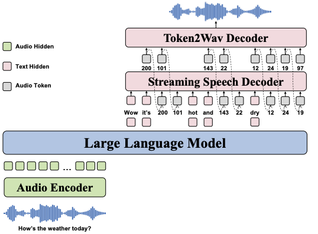

# OpenS2S: Advancing Fully Open-Source End-to-End Empathetic Large Speech Language Model

We present OpenS2S, a fully open-source, transparent and end-to-end large speech language model designed to enable empathetic speech interactions.


<a href='https://huggingface.co/CASIA-LM/OpenS2S'></a> <a href='https://huggingface.co/datasets/CASIA-LM/OpenS2S_Datasets'></a> <a href='https://arxiv.org/pdf/2507.05177'></a> <a href='https://casia-lm.github.io/OpenS2S'></a> 


## Model Architecture



As shown in the figure, OpenS2S consists of the following main components:

* Audio Encoder: The Audio Encoder is responsible for transforming this raw audio signal into a more manageable and meaningful representation.

* Instruction-Following LLM: The audio embeddings and text embeddings are concatenated to form interleaved input sequences for the large language model. We select Qwen3-8B-Instruct as the LLM, leveraging its robust text processing capabilities.

* Streaming Speech Decoder: The speech response is first converted into discrete tokens
using a supervised semantic speech tokenizer. Then, an autoregressive text-to-speech language model is used to generate speech tokens conditioned on the hidden states of the LLM, enabling real-time generation.

## Example

More examples can be found in the [project page](https://casia-lm.github.io/OpenS2S).


## Usage

### Setup

```bash
pip install -r requirements.txt
```


### Prepare 

1. Prepare the pretrained OpenS2S checkpoint

&emsp;&emsp;Download the pretrained OpenS2S model from [CASIA-LM/OpenS2S](https://huggingface.co/CASIA-LM/OpenS2S).

2. Prepare the Token2Wav Decoder

&emsp;&emsp;Download the decoder model from [THUDM/glm-4-voice-decoder](https://huggingface.co/THUDM/glm-4-voice-decoder).

### Inference

1. Start the controller
```bash
python controller.py
```
2. Start the model server
```bash
python model_worker.py --model-path your_opens2s_path --flow-path your_decoder_path
```

3. Launching web service locally
```bash
python web_demo.py --port 8888
```

## Training

### Data Preparation

This code requires input data to be in JSON Lines (jsonl) format. Each line of the file must be a valid JSON object containing exactly one key: messages.

Here is an example of a valid line in the jsonl file:
```python
{
    "messages": [
        {
            "role": "user", 
            "content": [
                {"text": "continue the following sentence", "audio": "", "speech_units": "", "spk_emb": ""},
                {"text": "", "audio": "/path/to/audio", "speech_units": "", "spk_emb": ""}
            ]
        },
        {
            "role": "assistant", 
            "content": [
                {"text": "hello", "audio": "", "speech_units": "<|audio_0|><|audio_1|>", "spk_emb": ""},
            ]
        }
    ]
}
```

If you want to construct continuation writing based on ASR data, please refer to [text_generation.py](./text_generation.py). If you want to convert audio waveform into speech units, please refer to [GLM-4-Voice](https://github.com/THUDM/GLM-4-Voice/blob/main/speech_tokenizer/utils.py#L40).


###  Train from scratch
1. Obtain the Audio Encoder, LLM bachbone, and Auto-regressive TTS LM.

2. Offline process training data
``` bash
export llm_path=/path/to/llm_backbone
export tts_path=/path/to/ar_tts
export audio_path=path/to/audio_encoder
python src/instruction_dataset.py offline \
    --dataroot /path/to/raw_data_dir \
    --manifest_files "*.jsonl" \
    --llm_path ${llm_path} \
    --tts_path ${tts_path} \
    --save_dir /path/to/processed_data_dir \
    --num_proc 64
```

4. train the model (connect different modules)
```bash
export data_dir=/path/to/processed_data_dir
export SAVE_ROOT=/path/to/checkpoints

bash scripts/train_from_scratch.sh
```


### Fine-tuning
1. Obtain pretrained checkpoints

2. Offline process
``` bash
export omnispeech_path=/path/to/omnispeech

python src/instruction_dataset.py offline \
    --dataroot /path/to/raw_data_dir \
    --manifest_files "*.jsonl" \
    --llm_path ${omnispeech_path} \
    --tts_path ${omnispeech_path}/tts/ \
    --save_dir /path/to/processed_data_dir \
    --num_proc 64
```

3. fine-tune the pretrained model
```bash
bash scripts/train_continue.sh
```

## Acknowledgements

We would like to thank the following projects and individuals for their contributions to the development of OpenS2S:
* [LLaMA-Omni2](https://github.com/ictnlp/LLaMA-Omni2)
* [Transformers](https://github.com/huggingface/transformers)
* [GLM-4-Voice](https://github.com/THUDM/GLM-4-Voice)
* [Qwen3](https://github.com/QwenLM/Qwen3)
* [Qwen2-Audio](https://github.com/QwenLM/Qwen2-Audio)


Thank you to all the open-source projects for their contributions to this project!


## License
* The license of our project is [Apache License 2.0]()

## Citation
If you find our project useful, hope you can star our repo and cite our paper as follows:
```
@article{wang2025opens2s,
  title={OpenS2S : Advancing Fully Open-Source End-to-End Empathetic Large Speech Language Model},
  author={Wang Chen, Peng Tianyu, Yang Wen, Bai Yinan, Wang Guangfu, Lin Jun, Jia Lanpeng, Wu Lingxiang, Wang Jinqiao, Zong Chengqing, Zhang Jiajun},
  journal={arXiv preprint arXiv:2507.05177},
  year={2025}
}
```
